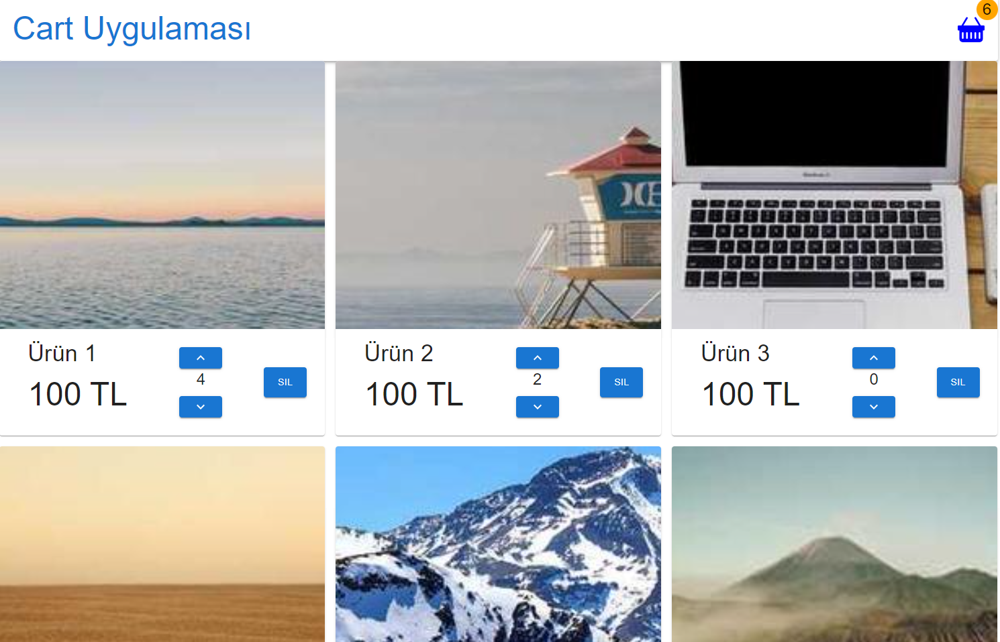

# Bu proje, React ve Redux kullanarak basit bir alışveriş sepeti uygulaması geliştirmenize yardımcı olur. Bu uygulama, ürünleri listeleyebilmenizi, sepete ekleyebilmenizi ve sepetten silebilmenizi sağlar.

